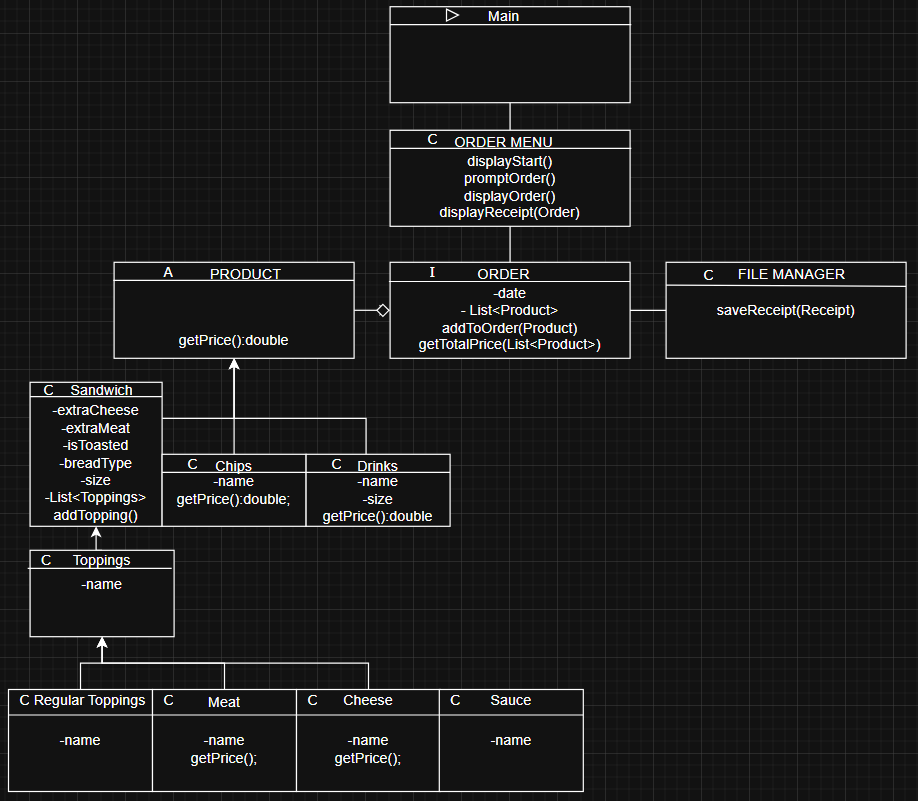
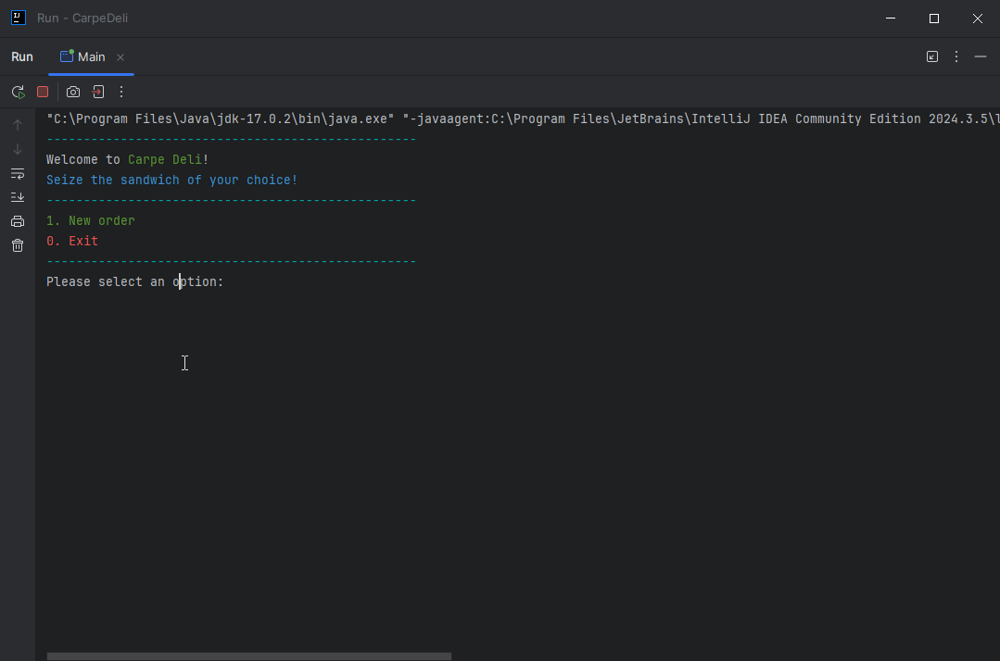
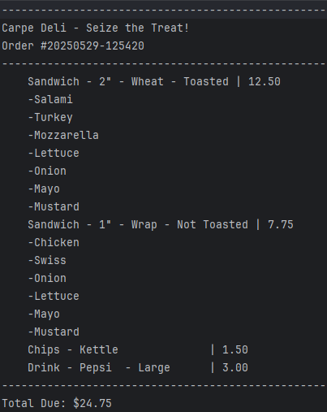

# Project Title

## Description of the Project

This program is a point-of-sale application for a Deli. Customers are prompted to place an order, and then pick from
a list of products including Sandwich, Chips, and a Drink. Users build sandwiches with their choice of (toasted) bread
and toppings. When finished ordering, users will be prompted to check out, where they can confirm their order. When confirmed,
a receipt is saved to a txt file. Each order creates a new receipt with the current date/time.

## User Stories

User stories that guided the development of this application.

- As an owner, I'd like receipts to be saved so that I have a history of my business transactions.
- As a customer, I'd like to fully customize my sandwich and order so that I may tailor my dining experience to myself.
- As a customer, I'd like a full receipt of my order so that I know exactly what I got and for how much I got it.
- As a customer, I'd like a confirmation screen before my order is finalized so that I can avoid any potential mistakes.
- As an owner, I'd like customers to be charged extra when they order extra meat/cheese so that I don't immediately run out of stock without making a few extra dollars.

## Setup

Instructions on how to set up and run the project using IntelliJ IDEA.

### Prerequisites

- IntelliJ IDEA: Ensure you have IntelliJ IDEA installed, which you can download from [here](https://www.jetbrains.com/idea/download/).
- Java SDK: Make sure Java SDK is installed and configured in IntelliJ.

### Running the Application in IntelliJ

Follow these steps to get your application running within IntelliJ IDEA:

1. Open IntelliJ IDEA.
2. Select "Open" and navigate to the directory where you cloned or downloaded the project.
3. After the project opens, wait for IntelliJ to index the files and set up the project.
4. Find the main class with the `public static void main(String[] args)` method.
5. Right-click on the file and select 'Run 'YourMainClassName.main()'' to start the application.

## Technologies Used

- Java: Maven 17.
- Java I/O, scanners/file reading.

## Demo

## Future Work

- Adding signature sandwiches
- Improvement of current functionalities/performance.
- Code compression

## Resources

- [Previous Project](https://github.com/AdampJessie/adv-car-dealership)
- [Raymond Maroun's Class GitHub](https://github.com/RayMaroun/yearup-spring-section-10-2025)
- [Potato Sensei](https://chatgpt.com/g/g-681d378b0c90819197b16e49abe384ec-potato-sensei)

## Team Members

- **Adam Jessie** - Diagram, Code, README Edits
- **Raymond Maroun** - README Template

## Thanks

- Thank you to Raymond Maroun for continuous support and guidance.
- A special thanks to all classmates for their support and inspiration.
 